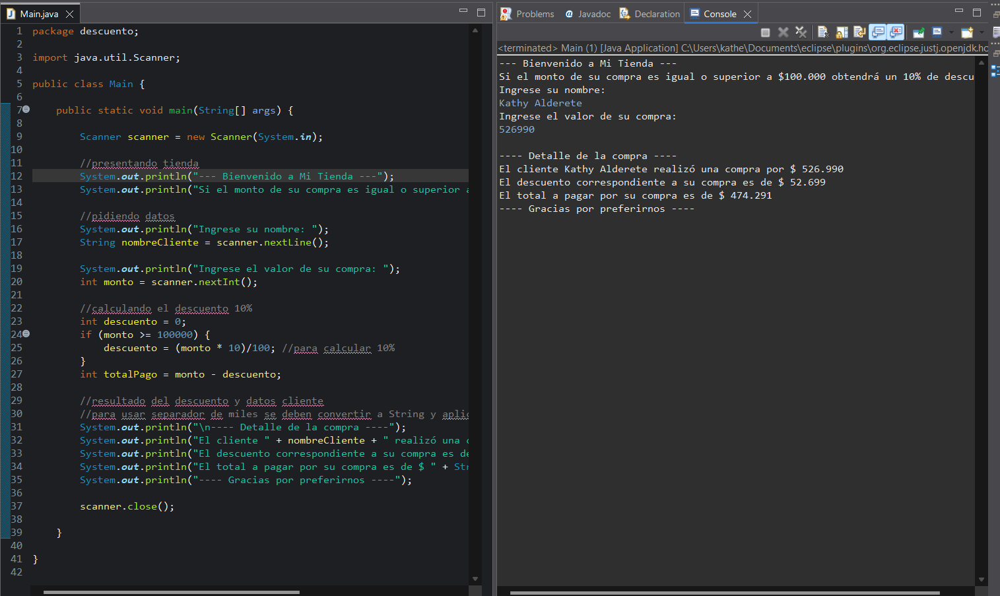

**_<h1 align="center">:vulcan_salute: Aplicando Descuento :computer:</h1>_**

**<h3>:blue_book: Contexto:</h3>**

Formas parte del equipo de desarrollo de una startup tecnológica que necesita automatizar algunos procesos internos básicos.

Se te asigna la tarea de diseñar un algoritmo que calcule si un cliente puede acceder a un descuento especial, según el monto total de su compra.

**<h3>:green_book: Requerimientos:</h3>**

- El algoritmo debe recibir el nombre del cliente y el monto total de su compra.
- Si el monto es mayor o igual a $100.000, debe aplicarse un 10% de descuento.
- El programa debe mostrar el nombre del cliente, el monto original, el descuento aplicado y el total a pagar.
- La solución debe ser ejecutada paso a paso y debe visualizarse el valor de las variables.

 
